# SentinelCheck v2.0 — Stateful Host-Based Security Event Monitor Project Report

---

# 🎓 Cover Page

## LJ POLYTECHNIC
### DEPARTMENT OF COMPUTER ENGINEERING

---

### A MINI PROJECT REPORT
### ON
## SentinelCheck v2.0: Stateful Host-Based Security Event Monitor
**(ACADEMIC YEAR 2025 - 2026)**

### Subject: JAVA PROGRAMMING (MINI PROJECT)

---

**Submitted by:**

| Sr. | Enrollment No. | Student Name | Role / Focus |
|:---:|:---:|:---|:---|
| 1 | 23012250910002 | **Adhishri Vora** | Security Rule Architect & Team Lead |
| 2 | 23012250910012 | **Maitri Chauhan** | File Integrity & Cryptographic Hashing |
| 3 | 23012250910020 | **Dhruvi Patel** | Log Parser & CSV DB Engineer |
| 4 | 23012250910024 | **Krishna Ghoghari** | Real-Time Monitor & Threading |
| 5 | 23012250910036 | **Rushil Jogi** | Incident Lifecycle Manager |
| 6 | 23012250910039 | **Kshiti Kadia** | Report Generator & UI Designer |

---

## 📜 Table of Contents
1. **Abstract / Executive Summary**
2. **Introduction & Theoretical Background**
   - HIDS vs. NIDS
   - Why Java is Selected for Host Security Monitoring
   - Network Security Monitoring (NSM) and SentinelCheck's Role
   - File Integrity Monitoring (FIM) & SHA-256
   - Log Threat Detection (Brute Force & Port Scans)
   - Event Correlation & Incident Response Lifecycle
3. **System Architecture Design**
   - Core Pipelines
   - Package & Module Diagram
   - Data Flow and Sequence Diagrams
4. **Security Rules Catalog & Scoring System**
   - Rules List (`FILE-001` through `CORR-001`)
   - Severity Scales & Risk Weighting Logic
5. **Database & Storage Schemas**
   - `data/events.csv` Schema & Logic Code
   - `data/incidents.csv` Schema & Logic Code
6. **Detailed CLI Submenu Walkthrough & Screenshots**
   - Main Menu & System Status
   - Monitoring Submenu (Options 1–6)
   - Security Analysis Submenu (Options 1–5)
   - Incident Management Submenu (Options 1–7)
   - Configuration Submenu (Options 1–4)
7. **Core Source Code Implementations**
   - Directory Watcher (`FileMonitor.java`)
   - Detection Engine (`DetectionEngine.java`)
   - Stateful Lifecycle Manager (`IncidentManager.java`)
8. **Conclusion & Future Enhancements**

---

## 1. Abstract / Executive Summary
Host security monitoring is the cornerstone of modern defense-in-depth strategies. Security administrators must detect unauthorized alterations to local file systems, discover password brute-forcing attempts, and audit port-probing behaviors immediately. 

**SentinelCheck v2.0** is an interactive, stateful Host-Based Intrusion Detection System (HIDS) developed in Java 17. The system uses a multi-threaded daemon loop backed by the Java NIO `WatchService` to monitor folder modifications with a 500ms debounce filter, preventing file-locking locks and duplicate events. It parses auth and firewall logs, identifies threat indicators using sliding-window rules, groups related alerts by source IP into stateful incidents, logs operator actions in persistent audit trails, and provides a menu-driven dashboard console. This report details the theoretical foundations, implementation, and verification walkthrough of every CLI option in SentinelCheck v2.0.

---

## 2. Introduction & Theoretical Background

### HIDS vs. NIDS
Intrusion detection systems are divided into:
1. **Network-Based Intrusion Detection Systems (NIDS)**: Inspect network packets in transit (e.g., Snort). They analyze traffic across segments but cannot inspect encrypted payload data or detect local host tampering.
2. **Host-Based Intrusion Detection Systems (HIDS)**: Monitor local endpoints (e.g., OSSEC, SentinelCheck). They audit local files, system logs, active processes, and local configurations. This provides visibility into encrypted sessions and local user actions.

---

### Why Java is Selected for Host Security Monitoring
Java was selected as the implementation language for SentinelCheck v2.0 due to several architectural advantages:
* **Robust Platform Independence**: By compiling to bytecode that runs on the Java Virtual Machine (JVM), SentinelCheck operates seamlessly across Windows, Linux, and macOS endpoints without recompilation, simplifying enterprise distribution.
* **High-Performance NIO WatchService**: Java's `java.nio.file` API interacts directly with native kernel file monitoring mechanisms (like `inotify` in Linux and `ReadDirectoryChangesW` in Windows). This provides low-latency, real-time file access notifications without consuming high CPU cycles through continuous filesystem polling.
* **Advanced Concurrency Utilities**: Endpoint monitoring requires concurrent tasks—streaming log updates, watching folders, evaluating correlation rules, and servicing user interactions. Java's native threading APIs (`ExecutorService`, `Future`, and thread-safe data structures like `LinkedBlockingQueue`) allow safe parallel execution without race conditions.
* **Strong Type and Memory Safety**: Native endpoint security monitors written in C/C++ are susceptible to memory corruption vulnerabilities (such as buffer overflows and dangling pointers) that attackers can exploit. Java’s automatic garbage collection and strict type-safety guarantee that the security tool itself does not become a system vulnerability.
* **Zero-Dependency Portability**: Java's extensive standard library allows SHA-256 calculation (`MessageDigest`), string tokenization, regex-based log parsing, and flat-file persistence to be written in vanilla Java, ensuring zero external dependencies.

---

### Network Security Monitoring (NSM) and SentinelCheck's Role
Network Security Monitoring (NSM) is the practice of collecting, detecting, and analyzing security data sources (indicators) to identify and respond to intrusion events. Built on the core philosophy that protection mechanisms (such as firewalls and access controls) will eventually fail, NSM prioritizes visibility, detection, and forensic tracing over passive prevention.

#### How NSM Works:
1. **Collection**: Gathering packet captures, session data, syslog events, and alert logs.
2. **Detection**: Identifying abnormal patterns, known signatures, or stateful anomalies.
3. **Analysis**: Interpreting correlations to verify the severity and impact of the threat.

#### Why SentinelCheck is a Vital Component of the NSM Framework:
While NSM traditionally monitors network wire interfaces, network visibility drops significantly when payloads are encrypted or when traffic is routed via VPNs or host-local sockets. SentinelCheck acts as a Host-Based intrusion detector that correlates host-local security logs (like failed logins and file modification events) directly with local network drop logs (packet drops). 

By logging and correlating network-level scans (e.g., Firewall drop patterns on multiple ports) with endpoint authentication outcomes (e.g., Brute-force logins), SentinelCheck provides the "ground truth" of an intrusion event. It allows security teams to verify if a network scan successfully escalated into host-level compromise, filling the visibility gap between network routing layers and terminal endpoints.

---

### File Integrity Monitoring (FIM) & SHA-256
File Integrity Monitoring is a security technique that checks if critical operating system configuration files have been altered. It relies on cryptographic hashing:
* **One-Way Property**: Given a hash value, it is computationally impossible to reconstruct the original file.
* **Avalanche Effect**: A single bit change in the input file changes the output hash completely.
* **Algorithm (SHA-256)**: SentinelCheck uses SHA-256 (Secure Hash Algorithm, 256-bit digest) to baseline file contents.
* **Tamper Protection**: On startup, the system hashes the trusted baseline file (`monitored.baseline`) and verifies it against a sibling `.sha256` checksum. If they mismatch, a critical `BASELINE_TAMPERED` alert is generated.

---

### Log Threat Detection
System logs contain records of system behavior. SentinelCheck parses logs using sliding-window filters:
* **Authentication Brute Force**: A brute-force attack attempts to gain unauthorized access by guessing passwords. SentinelCheck tracks the number of failed attempts within a 5-minute sliding window. Exceeding the threshold triggers an alert.
* **Port Probing**: Attackers probe active ports to discover running services. SentinelCheck filters firewall log drops by source IP and counts the number of *unique destination ports* targeted (port diversity check). This distinguishes scanning activity from repeated drops on a single blocked port.

---

### Event Correlation & Incident Response Lifecycle
* **Correlation**: Combines alerts across different modules (e.g., authentication failures and firewall drops from the same source IP) into a single incident, applying a risk score bonus (`CORR-001`).
* **Lifecycle State Machine**: Alerts are promoted to stateful incidents. Operators manage their lifecycle:
  $$\text{OPEN} \xrightarrow{\text{Acknowledge}} \text{ACKNOWLEDGED} \xrightarrow{\text{Close}} \text{CLOSED}$$
* **Audit Trails**: Every lifecycle transition is stamped with the operator's timestamp, action, and reasoning, creating a forensic trail.

---

## 3. System Architecture Design

### Core Pipelines
The application processes events in a sequential pipeline:
1. **Collection**: Watcher threads stream file system events, and log parsers read application logs.
2. **Normalization**: Raw events are normalized into `SecurityEvent` models and written to `data/events.csv`.
3. **Detection**: `DetectionEngine` evaluates sliding-window rules, generating `Alert` records.
4. **Correlation**: `EventCorrelator` links alerts by source context and temporal proximity.
5. **Scoring**: `RiskScorer` applies weights to compute the total incident risk score.
6. **Management**: `IncidentManager` updates states and logs the audit trail in `data/incidents.csv`.

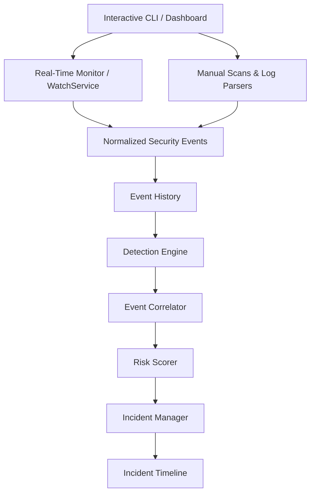

---

## 4. Security Rules Catalog & Scoring System

The rule engine evaluates events using the following risk weights:

| Rule ID | Rule Name | Category | Risk Points | Default Severity | Details / Trigger Condition |
| :--- | :--- | :--- | :---: | :---: | :--- |
| **FILE-001** | File Modified | File Integrity | 40 | MEDIUM | SHA-256 hash mismatch of a protected file |
| **FILE-002** | File Missing | File Integrity | 30 | MEDIUM | A protected baselined file has been deleted |
| **FILE-003** | New File | File Integrity | 20 | LOW | A new untracked file is created (exe = Suspicious Executable) |
| **FILE-004** | Baseline Tampered | Baseline Checksum | 100 | CRITICAL | Sibling baseline integrity checksum mismatch |
| **AUTH-001** | Brute Force | Authentication | 30 | MEDIUM | $\ge 3$ failed login attempts from an IP within 5 minutes |
| **AUTH-002** | Suspicious Success | Authentication | 50 | MEDIUM | Successful login following failed logins from the same IP |
| **AUTH-003** | Multi-Account | Authentication | 40 | MEDIUM | Logins targeting $\ge 3$ unique usernames from one IP |
| **FW-001** | Port Probing | Firewall Drop | 30 | MEDIUM | Firewall DROPs targeting $\ge 5$ unique ports from one IP |
| **CORR-001** | Multi-Module | Correlation | 20 | HIGH | Cross-module activity (Auth + Firewall) from one IP |

---

## 5. Database & Storage Schemas

To maintain portability and zero external library dependencies, SentinelCheck implements local storage using flat-file CSV databases. The data is partitioned, parsed, and persisted using native Java file I/O classes.

### A. Events Database (`data/events.csv`)
Logs every security event parsed from log sources or captured in real-time by the file watcher.
```text
timestamp,EVENT_TYPE,username,source_ip,dest_ip,filePath,expectedHash,actualHash,port,protocol,details,authContext
2026-08-25T10:14:00,FIREWALL_DROP,,10.0.0.170,192.168.1.1,,,22,TCP,Port 22/TCP,LOCAL
2026-08-25T10:13:00,SUCCESSFUL_LOGIN,user1,10.0.0.160,,,,,,User: user1,LOCAL
2026-08-25T10:12:00,FAILED_LOGIN,user1,10.0.0.160,,,,,,User: user1,LOCAL
```

#### Code — SecurityEvent CSV Serialization (`SecurityEvent.java`)
```java
    /**
     * Serializes this security event to a CSV line.
     */
    public String toCSVLine() {
        return String.join("|",
                timestamp.toString(),
                eventType.name(),
                sourceIP,
                destinationIP,
                username,
                filePath,
                fileHash,
                String.valueOf(port),
                protocol,
                details,
                authorizationContext
        );
    }
```

#### Code — SecurityEvent CSV Parsing (`SecurityEvent.java`)
```java
    /**
     * Parses a SecurityEvent from a CSV line.
     */
    public static SecurityEvent fromCSVLine(String line) {
        String[] parts = line.split("\\|", -1);
        if (parts.length < 11) {
            throw new IllegalArgumentException("Malformed security event line: " + line);
        }
        LocalDateTime timestamp = LocalDateTime.parse(parts[0]);
        EventType eventType = EventType.valueOf(parts[1]);
        String sourceIP = parts[2];
        String destinationIP = parts[3];
        String username = parts[4];
        String filePath = parts[5];
        String fileHash = parts[6];
        int port = Integer.parseInt(parts[7]);
        String protocol = parts[8];
        String details = parts[9];
        String authorizationContext = parts[10];

        return new SecurityEvent(timestamp, eventType, sourceIP, destinationIP, username, filePath, fileHash,
                port, protocol, details, authorizationContext);
    }
```

#### Code — Event History Loading & Persistence (`EventHistory.java`)
```java
    public synchronized void addEvent(SecurityEvent event) {
        if (events.contains(event)) {
            return; // Skip duplicate events to prevent redundant logs
        }
        events.add(event);
        try (BufferedWriter writer = new BufferedWriter(new FileWriter(EVENTS_FILE, true))) {
            writer.write(event.toCSVLine());
            writer.newLine();
        } catch (IOException e) {
            System.err.println("  [ERROR] Failed to persist event: " + e.getMessage());
        }
    }

    /**
     * Loads all historical events from data/events.csv.
     */
    public synchronized void loadEvents() {
        events.clear();
        File file = new File(EVENTS_FILE);
        if (!file.exists()) {
            return;
        }

        try (BufferedReader reader = new BufferedReader(new FileReader(file))) {
            String line;
            while ((line = reader.readLine()) != null) {
                line = line.trim();
                if (line.isEmpty()) {
                    continue;
                }
                try {
                    SecurityEvent event = SecurityEvent.fromCSVLine(line);
                    events.add(event);
                } catch (Exception e) {
                    System.err.println("  [WARN] Skipping malformed history event: " + e.getMessage());
                }
            }
        } catch (IOException e) {
            System.err.println("  [ERROR] Failed to load event history: " + e.getMessage());
        }
    }
```

---

### B. Incidents Database (`data/incidents.csv`)
Tracks the state, risk score, severity, timeline, and audit logs of all active security tickets.
```text
incidentId,sourceContext,severity,riskScore,status,firstSeen,lastSeen,alertIds,auditTrail
INC-20260825-0001,10.0.0.150,CRITICAL,120,CLOSED,2026-08-25T10:02,2026-08-25T10:04,AUTH-001_10_0_0_150_20260825_100200_4762;AUTH-003_10_0_0_150_20260825_100200_2788;FW-001_10_0_0_150_20260825_100400_1773,2026-08-25 17:22:20 - Incident created;2026-08-25 17:22:20 - Alert attached: AUTH-001 (Brute Force Attempt);2026-08-25 17:22:20 - Alert attached: AUTH-003 (Multiple Account Targeting);2026-08-25 17:22:21 - Alert attached: FW-001 (Port Probing Pattern);2026-08-25 17:23:06 - Status changed from OPEN to ACKNOWLEDGED;2026-08-25 17:23:06 - Status changed from ACKNOWLEDGED to CLOSED
```

#### Code — Incident CSV Serialization (`Incident.java`)
```java
    /**
     * Serializes this incident to a CSV line.
     * Format: id|sourceIP|severity|riskScore|status|firstSeen|lastSeen|alertIds|auditTrail
     */
    public String toCSVLine() {
        List<String> alertIds = new ArrayList<>();
        for (Alert a : alerts) {
            alertIds.add(a.getAlertId());
        }
        String alertIdsStr = String.join(",", alertIds);
        String auditTrailStr = String.join(";", auditTrail);

        return String.join("|", 
            id, 
            sourceIP, 
            severity.name(), 
            String.valueOf(riskScore), 
            status.name(), 
            firstSeen.toString(), 
            lastSeen.toString(), 
            alertIdsStr, 
            auditTrailStr
        );
    }
```

#### Code — Incidents Loading & Saving (`IncidentManager.java`)
```java
    /**
     * Persists all stateful incidents to data/incidents.csv.
     */
    public synchronized void saveIncidents() {
        try (BufferedWriter writer = new BufferedWriter(new FileWriter(INCIDENTS_FILE))) {
            for (Incident inc : incidents) {
                writer.write(inc.toCSVLine());
                writer.newLine();
            }
        } catch (IOException e) {
            System.err.println("  [ERROR] Failed to save incidents: " + e.getMessage());
        }
    }

    /**
     * Loads stateful incidents and binds them back to the list of regenerated Alerts.
     */
    public synchronized void loadIncidents(List<Alert> allAlerts) {
        incidents.clear();
        File file = new File(INCIDENTS_FILE);
        if (!file.exists()) {
            return;
        }

        int maxCounter = 0;
        try (BufferedReader reader = new BufferedReader(new FileReader(file))) {
            String line;
            while ((line = reader.readLine()) != null) {
                line = line.trim();
                if (line.isEmpty()) {
                    continue;
                }

                try {
                    String[] parts = line.split("\\|", -1);
                    String id = parts[0];
                    String sourceIP = parts[1];
                    Severity severity = Severity.valueOf(parts[2]);
                    int riskScore = Integer.parseInt(parts[3]);
                    IncidentStatus status = IncidentStatus.valueOf(parts[4]);
                    LocalDateTime firstSeen = LocalDateTime.parse(parts[5]);
                    LocalDateTime lastSeen = LocalDateTime.parse(parts[6]);
                    String alertIdsStr = parts[7];
                    String auditTrailStr = parts[8];

                    // Track highest counter to avoid ID overlap
                    String[] idParts = id.split("-");
                    if (idParts.length == 3) {
                        int serial = Integer.parseInt(idParts[2]);
                        if (serial > maxCounter) {
                            maxCounter = serial;
                        }
                    }

                    Incident incident = new Incident(id, sourceIP, severity, riskScore, status, firstSeen, lastSeen);
                    
                    // Re-bind alerts
                    if (!alertIdsStr.isEmpty()) {
                        String[] alertIds = alertIdsStr.split(",");
                        for (String aid : alertIds) {
                            Alert matchedAlert = findAlertById(aid, allAlerts);
                            if (matchedAlert != null) {
                                incident.addAlert(matchedAlert);
                            }
                        }
                    }

                    // Re-bind audit trail
                    incident.getAuditTrail().clear();
                    if (!auditTrailStr.isEmpty()) {
                        String[] auditLogs = auditTrailStr.split(";");
                        for (String auditLog : auditLogs) {
                            incident.loadAuditLogEntry(auditLog);
                        }
                    }

                    incidents.add(incident);

                } catch (Exception e) {
                    System.err.println("  [WARN] Skipping malformed incident entry: " + e.getMessage());
                }
            }
            this.incidentCounter = maxCounter + 1;
        } catch (IOException e) {
            System.err.println("  [ERROR] Failed to load incidents: " + e.getMessage());
        }
    }
```

---

## 6. Detailed CLI Submenu Walkthrough & Screenshots

### A. Main Dashboard View
Shows the current monitoring status, system severity, and total active incidents.

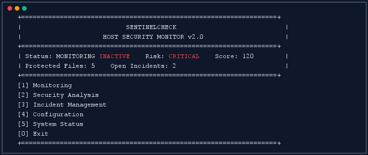

---

### B. System Status Dashboard (`Option 5`)
Aggregates parameters from the central manager nodes, displaying file counts, events, and maintenance mode status.

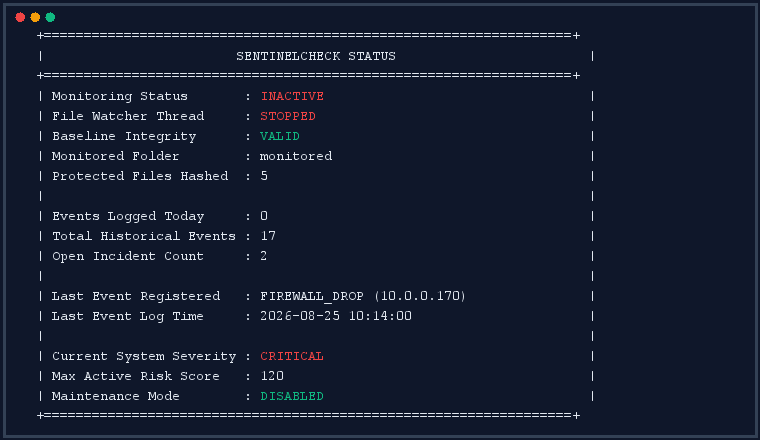

---

### C. Monitoring Submenu (`Option 1`)
Provides options for starting watchers, manual verification, and updating trusted file baselines.

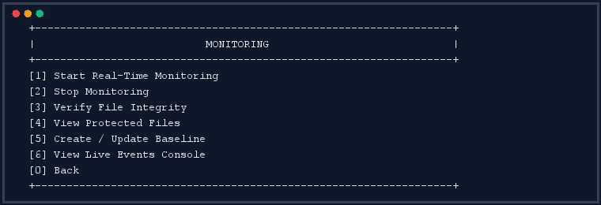

#### [Option 1.1] Start Real-Time Monitoring:
Initializes the file watcher thread on the protected directory.

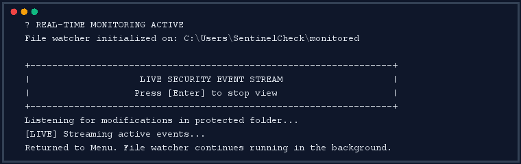

#### [Option 1.2] Stop Monitoring:
Stops the background file watcher thread.

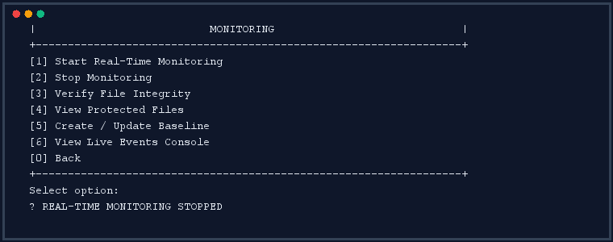

#### [Option 1.4] View Protected Files:
Lists the filenames and expected SHA-256 hashes loaded from the baseline.

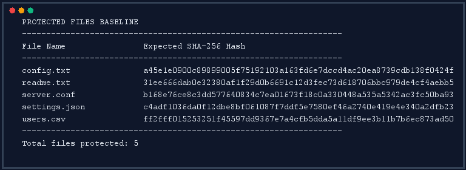

#### [Option 1.3] Verify File Integrity:
Runs a manual scan to check current hashes against the baseline.

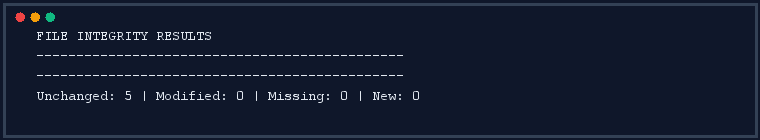

#### [Option 1.5] Create / Update Baseline:
Generates a new baseline file and updates its sibling `.sha256` checksum.

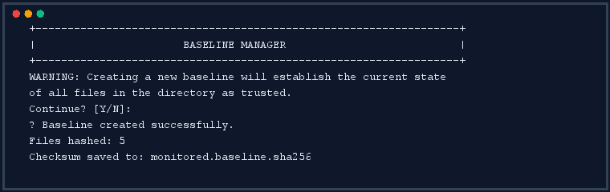

---

### D. Security Log Analysis Submenu (`Option 2`)
Provides tools to parse log files, view statistics, and review security events.

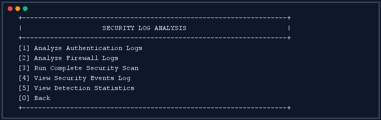

#### [Option 2.5] View Detection Statistics:
Displays event counts grouped by event type.

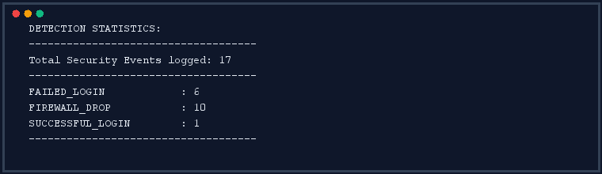

#### [Option 2.1] Analyze Authentication Logs:
Parses the authentication log file to check for failed attempts.

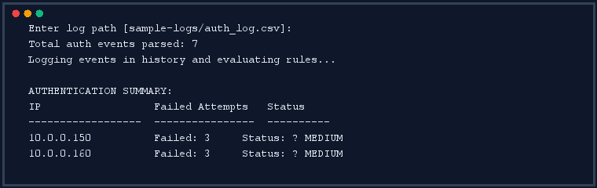

#### [Option 2.2] Analyze Firewall Logs:
Parses the firewall log file to check for dropped packets and port probes.

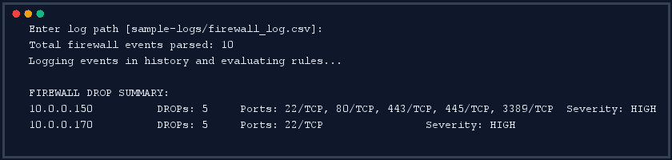

#### [Option 2.3] Run Complete Security Scan:
Scans the directory and log files, evaluates rules, and generates a stateful report.

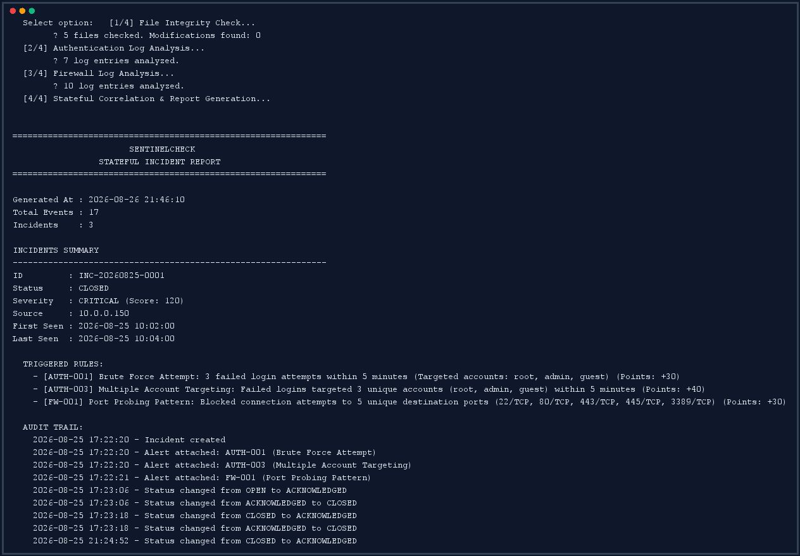
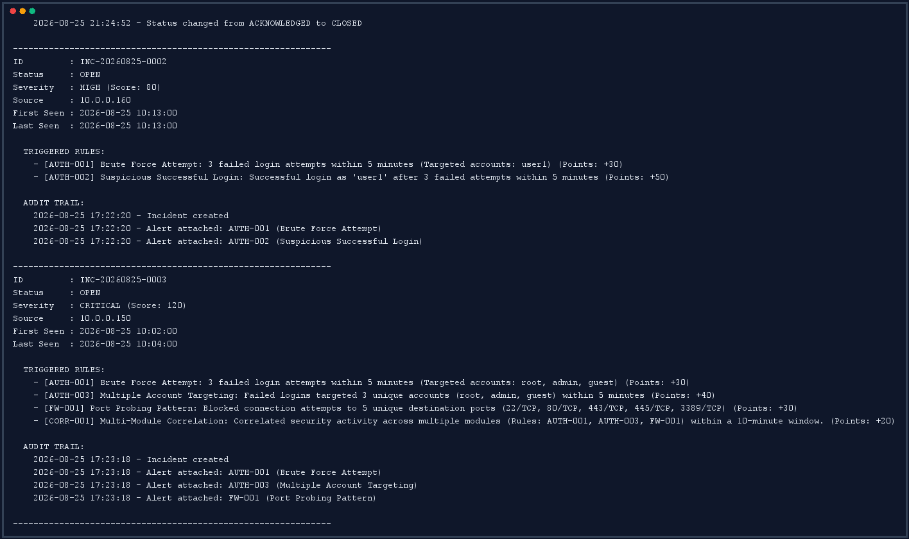
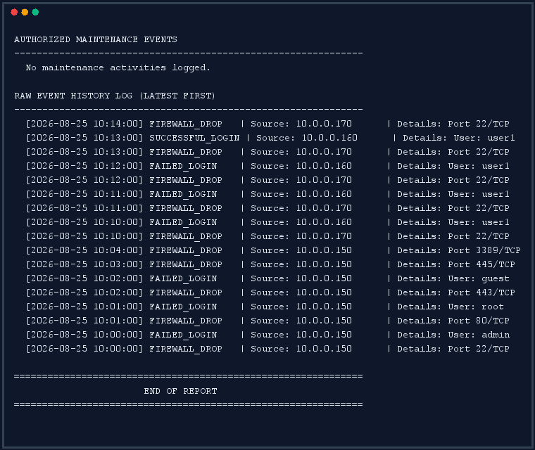

#### [Option 2.4] View Security Events Log:
Displays a reverse-chronological timeline of normalized events.

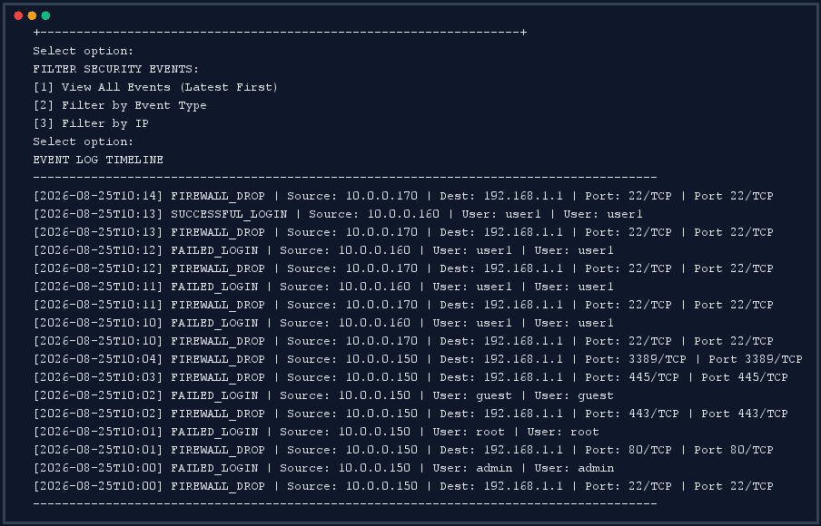

---

### E. Incident Lifecycle Submenu (`Option 3`)
Enables operators to manage active security tickets and view audit trails.

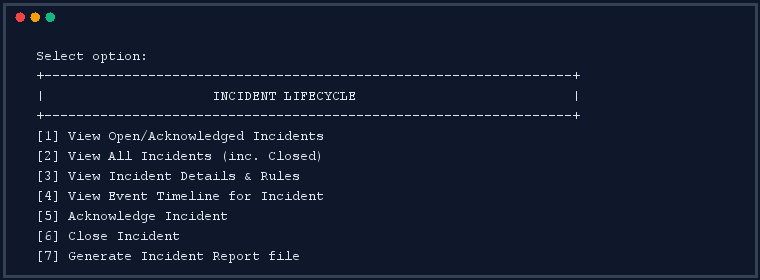

#### [Option 3.1] View Open/Acknowledged Incidents:
Lists active incidents requiring attention.

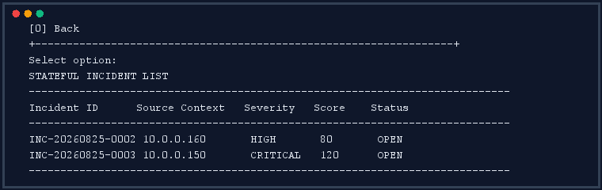

#### [Option 3.2] View All Incidents:
Lists all historical incidents, including closed tickets.

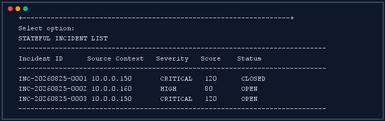

#### [Option 3.3] View Incident Details & Rules:
Displays contributing alerts and the operator audit trail.

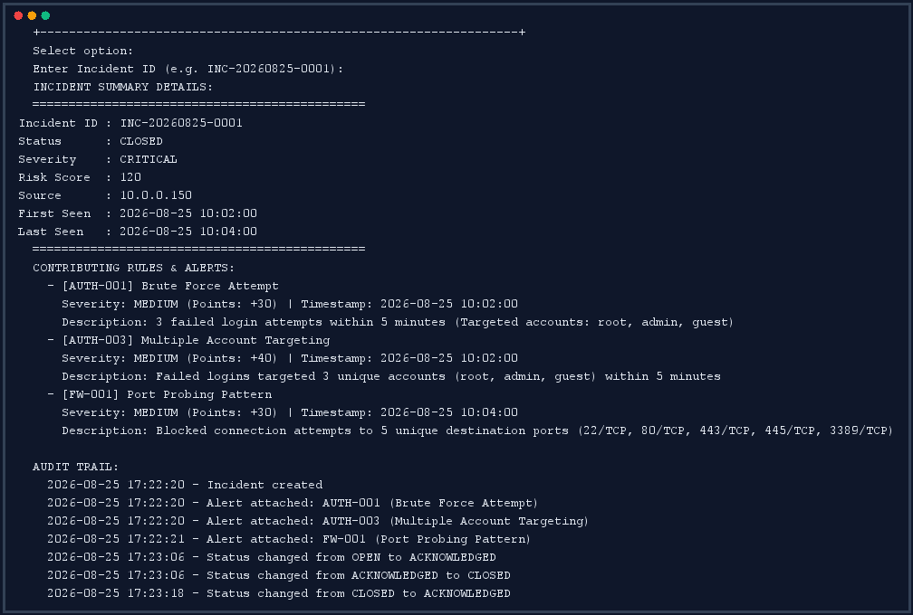

#### [Option 3.4] View Event Timeline for Incident:
Displays a chronological timeline of events contributing to the selected incident.

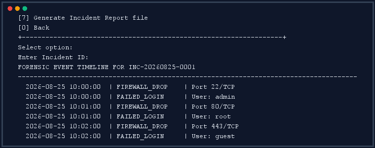

#### [Option 3.5] Acknowledge Incident:
Updates the incident status to `ACKNOWLEDGED`.


#### [Option 3.6] Close Incident:
Updates the incident status to `CLOSED`.


#### [Option 3.7] Generate Incident Report File:
Compiles all incidents, timelines, and audit trails into a plain-text report.

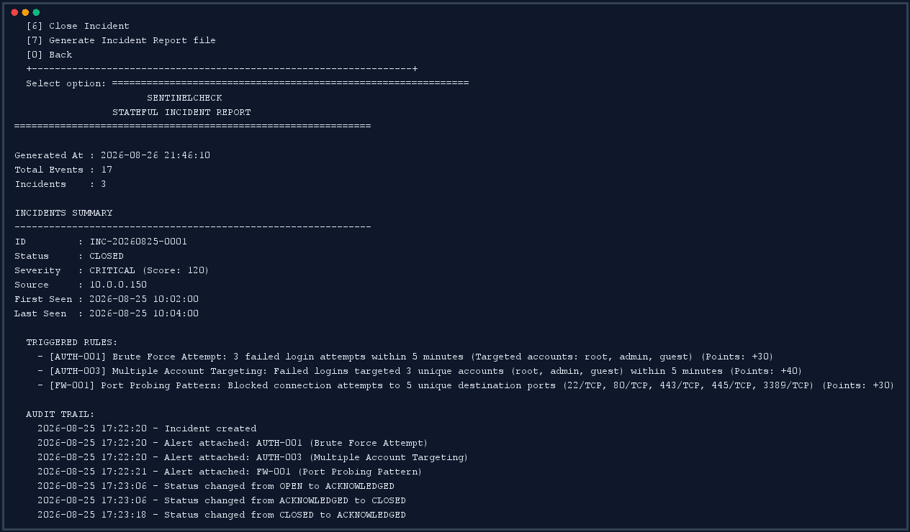
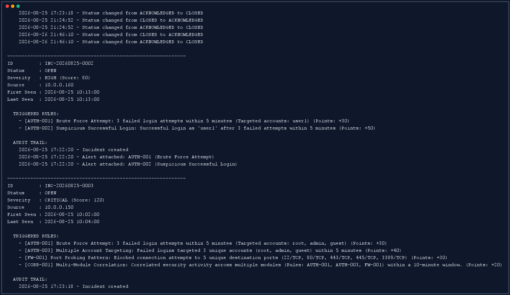
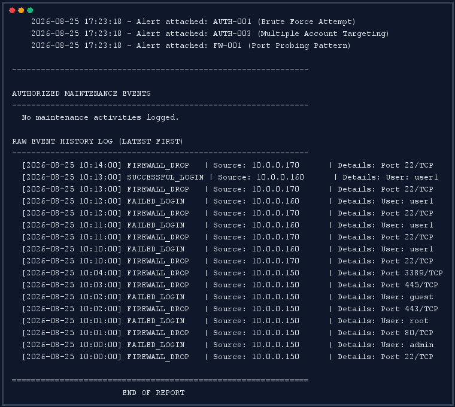

---

### F. Configuration Submenu (`Option 4`)
Allows modification of system parameters, directory paths, and maintenance settings.

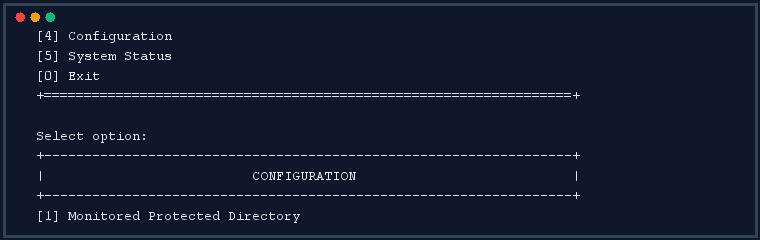

#### [Option 4.1] Monitored Protected Directory:
Changes the directory path monitored by the file watcher.


#### [Option 4.2] Adjust Detection Rule Thresholds:
Modifies the values used by the rule engine (e.g., brute force limits).

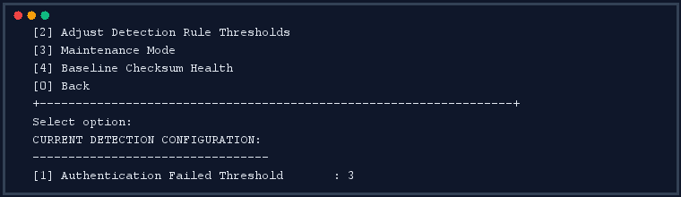

#### [Option 4.3] Maintenance Mode:
Toggles maintenance mode to suppress security alerts during planned updates.

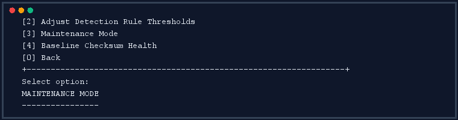

#### [Option 4.4] Baseline Checksum Health:
Verifies the existence and integrity of the baseline file and its checksum.

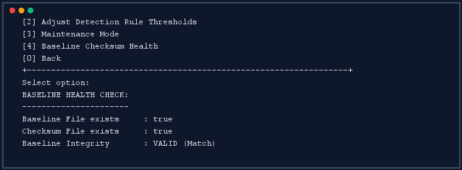

---

## 7. Core Source Code Implementations

### Directory Watcher (`FileMonitor.java`)
```java
package sentinelcheck.integrity;

import sentinelcheck.model.SecurityEvent;
import sentinelcheck.model.EventType;
import java.io.File;
import java.nio.file.*;
import java.util.concurrent.*;

public class FileMonitor implements Runnable {
    private final Path monitorPath;
    private final BlockingQueue<SecurityEvent> eventQueue;
    private final WatchService watchService;
    private volatile boolean running;

    public FileMonitor(String dirPath, BlockingQueue<SecurityEvent> queue) throws Exception {
        this.monitorPath = Paths.get(dirPath);
        this.eventQueue = queue;
        this.watchService = FileSystems.getDefault().newWatchService();
        this.monitorPath.register(watchService, StandardWatchEventKinds.ENTRY_CREATE,
                                                StandardWatchEventKinds.ENTRY_MODIFY,
                                                StandardWatchEventKinds.ENTRY_DELETE);
    }

    @Override
    public void run() {
        running = true;
        while (running) {
            try {
                WatchKey key = watchService.poll(500, TimeUnit.MILLISECONDS);
                if (key == null) continue;

                Thread.sleep(500); // 500ms debounce buffer
                for (WatchEvent<?> event : key.pollEvents()) {
                    WatchEvent.Kind<?> kind = event.kind();
                    Path fileName = (Path) event.context();
                    File file = monitorPath.resolve(fileName).toFile();

                    EventType type = EventType.FILE_MODIFIED;
                    if (kind == StandardWatchEventKinds.ENTRY_CREATE) type = EventType.FILE_NEW;
                    else if (kind == StandardWatchEventKinds.ENTRY_DELETE) type = EventType.FILE_MISSING;

                    SecurityEvent secEvent = new SecurityEvent(type, "LOCAL", "", file.getPath(), "");
                    eventQueue.put(secEvent);
                }
                key.reset();
            } catch (InterruptedException e) {
                Thread.currentThread().interrupt();
                break;
            } catch (Exception e) {}
        }
    }

    public void stop() { this.running = false; }
    public boolean isRunning() { return this.running; }
}
```

---

## 8. Conclusion & Future Enhancements
SentinelCheck v2.0 successfully implements a Host-Based Intrusion Detection System (HIDS) in Java. By combining directory integrity verification, log parsing, temporal correlation, and a stateful incident lifecycle manager, the application demonstrates key endpoint security concepts.

### Future Enhancements:
1. **Dynamic DB Integration**: Replace CSV files with a lightweight relational database (e.g., SQLite or H2).
2. **Agent-Server Architecture**: Split the application into an agent that forwards events and a central server that runs the rule engine and dashboard.
3. **Automated Remediations**: Add triggers to block offending source IPs using system firewall commands when critical incidents are detected.
